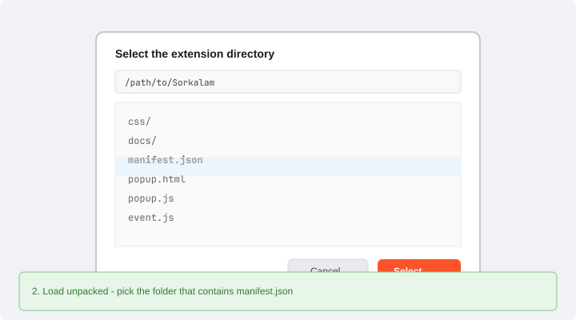
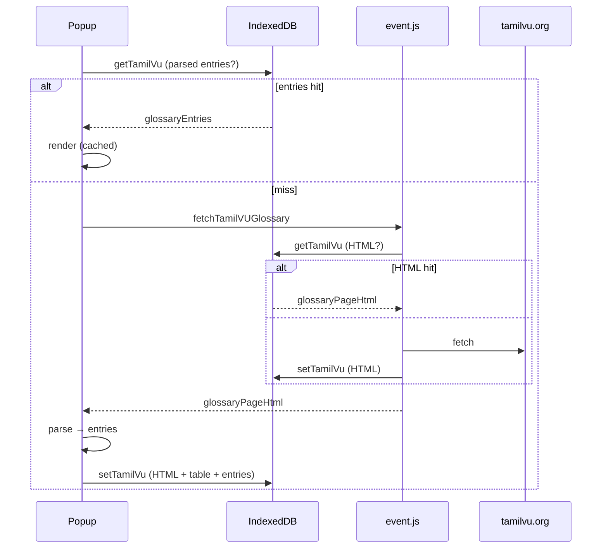

# SORKALAM (சொற்களம்)

****Tamil ↔ English Dictionary, Thesaurus & Technical Glossary** — Modern Manifest V3 Edition** — Modern Manifest V3 Edition

> **Note**: This is a **developer/modernized version (v6.0)** primarily intended for **local testing in Brave (or Chrome) Developer Mode**. It is **not currently optimized for Chrome Web Store publication** (though it can be published later with minor changes).
>
> **Still on the old Web Store build (MV2)?** See [TECH_DETAILS.md — Still using Manifest V2](TECH_DETAILS.md#still-using-the-manifest-v2-v55-build) (extension ID `jacclialpnbekableeihpjnojebafhho`, archived listing, or v5.5 source at [github.com/p10ns11y/sorkalam-extension/tree/v5-legacy](https://github.com/p10ns11y/sorkalam-extension/tree/v5-legacy) in dev mode).

<p align="center">
  
  <strong lang="ta" style="font-size:1.35rem;vertical-align:middle">சொற்களம்</strong>
</p>

---
## Features

- 🔍 **Wiktionary** lookup (English ↔ Tamil) in the popup
- 🔗 **Grok** and **Grokipedia** open in a new tab with your search term (more detail on demand)
- 📚 **Tamil Virtual University (Tamilvu.org)** technical glossary
- 🧠 Smart language detection (Tamil ↔ English)
- ⚡ Auto-lookup of selected text when opening the extension
- 🔗 Clickable results for quick follow-up searches
- 🎨 Modern, lightweight UI (no jQuery)

---

## 🕰️ The Time Traveler's Story

> **2014 → 2026**  
> A time traveler from the future meets the original Sorkalam.

In **2014**, a developer created *Sorkalam* with a simple dream:  
**“Let Tamil learners tap any word and instantly understand it — without ever leaving the browser tab.”**

No new tabs. No distraction. Just pure, focused learning.

Ten years later, a time traveler arrived from **2026**. They opened the old code, smiled, and said:

> “The heart is still beating.  
> Only the clothes have changed.”

They modernized everything — Manifest V3, clean vanilla JavaScript, beautiful new UI, faster performance — but kept the original promise intact:

- Instant glossary/thesaurus lookup  
- No context switching  
- Deep respect for the learner’s focus

Just like how **Grok** on X lets you tap **any post** and dive deeper without leaving your timeline, *Sorkalam* does the same for Tamil technical terms.

The time traveler left behind only one message before disappearing:

> “Some tools are not just software.  
> They are quiet bridges between generations of curious minds.”

---

## Install in Brave (Developer Mode)

Brave is Chromium-based, so loading an unpacked extension works the same way as in Chrome. Use these steps for local development and testing.

### Prerequisites

- [Brave Browser](https://brave.com/) installed
- A clone or download of this repository on your machine

### Step-by-step

1. **Get the source**
   ```bash
   git clone https://github.com/p10ns11y/sorkalam-extension.git
   cd sorkalam-extension
   ```
   Or download and unzip the project. You need the folder that contains `manifest.json` at its root.

2. **Open the extensions page**
   - In the address bar, go to **`brave://extensions`**
   - Or: **Menu (☰) → Extensions → Manage Extensions**

3. **Turn on Developer mode**
   - Use the **Developer mode** toggle in the **top-right** of the page.

   

4. **Load the extension**
   - Click **Load unpacked**
   - In the file picker, select the **sorkalam-extension** folder (the directory that contains `manifest.json`, `popup.html`, `event.js`, etc.)
   - Do **not** select a parent folder or a subfolder like `css/` — Brave needs the folder where `manifest.json` lives.

   

5. **Pin Sorkalam to the toolbar**
   - Click the **puzzle piece** (extensions) icon in the Brave toolbar
   - Find **Sorkalam** and click the **pin** icon so it stays visible

6. **Reload after code changes**
   - Each time you edit extension files, go back to `brave://extensions`
   - On the Sorkalam card, click the **reload** (circular arrow) button
   - Or toggle the extension off and on

### Troubleshooting (Brave)

| Issue | What to try |
|-------|-------------|
| **Load unpacked** is greyed out | Enable **Developer mode** first |
| Extension fails to load | Confirm you selected the folder with `manifest.json`; check the error on the extension card |
| Selected text not detected | Reload the extension, refresh the webpage, then select text **before** opening the popup |
| Lookup fails on some sites | Restricted pages (`brave://`, Web Store, some PDFs) block content scripts — try a normal article page |
| Changes not visible | Click **Reload** on `brave://extensions` after saving files |

### Chrome / Chromium variants

The same flow applies with these URLs:

| Browser | Extensions URL |
|---------|------------------|
| Brave | `brave://extensions` |
| Chrome | `chrome://extensions` |
| Edge | `edge://extensions` |
| Chromium | `chrome://extensions` |

---

## Usage

1. Click the Sorkalam icon in the toolbar.
2. Type a word (Tamil or English) and press **Enter** (defaults to Wiktionary).
3. Tap a provider chip: **W** (Wiktionary), **TVU** (Tamil VU glossary, in-popup), **G** (Grok), **GP** (Grokipedia, new tab).

| Chip | Where results appear | URL pattern |
|------|----------------------|-------------|
| W | Popup | Wiktionary API |
| TVU | Popup | Tamil VU (via service worker) |
| G | New tab | `https://grok.com/?q={query}` |
| GP | New tab | `https://grokipedia.com/search?q={query}` |
4. Click any word in the results for a quick follow-up search.

**Pro tip**: Highlight a word on any webpage → open the Sorkalam popup → it fills the input and runs a Wiktionary lookup automatically.


### Tamil VU lookup (fetch + IndexedDB cache)

Tamil VU requests go through the service worker (CORS bypass). Results are cached in **IndexedDB** ([`glossary-cache.js`](glossary-cache.js)) — parsed entries in the popup, HTML in the service worker:



More detail: [TECH_DETAILS_V6.md — Tamil VU Glossary](TECH_DETAILS_V6.md#lookup-tamil-vu-glossary).

---

## Technical details

Documentation is split by version:

| Document | Version | Description |
|----------|---------|-------------|
| **[TECH_DETAILS_V6.md](TECH_DETAILS_V6.md)** | **v6.0 (current)** | MV3 architecture, Wiktionary + Tamil VU lookups, selection capture, file map |
| [TECH_DETAILS.md](TECH_DETAILS.md) | v5.x (legacy) | Original Glosbe/default flow, jQuery, MV2 patterns — kept for reference |

**Start here for development:** [TECH_DETAILS_V6.md](TECH_DETAILS_V6.md)

---

## Project Structure

```
sorkalam-extension/
├── manifest.json          # MV3 configuration
├── popup.html             # Main popup UI
├── popup.js               # Core lookup logic
├── glossary-cache.js      # Tamil VU IndexedDB cache (7-day TTL)
├── tamilvu-glossary-parse.js  # Tamil VU HTML table → JSON (DOMParser)
├── event.js               # Service worker (selection relay)
├── content.js             # Page selection capture
├── css/
│   └── popup.css          # Styling
├── .cursor/skills/sorkalam/   # Lean Cursor skill for this extension (4 files)
├── images/                # README screenshots and store archive (PNG)
├── icon.png
├── logo.svg
├── TECH_DETAILS_V6.md    # v6.0 technical reference (current)
├── TECH_DETAILS.md       # Legacy v5.x technical reference
├── CHANGELOG.md
└── README.md
```

---

## References

Development guidance for agents:

- **In-repo (lean):** [`.cursor/skills/sorkalam/`](.cursor/skills/sorkalam/) — project skill + three MV3 reference snippets (message passing, service worker, content scripts).
- **Upstream (link only, not vendored):** [GoogleChrome/modern-web-guidance](https://github.com/GoogleChrome/modern-web-guidance/tree/main) — full chrome-extensions skill and web UI guides; use `npx -y modern-web-guidance@latest` when you need a specific pattern.

See [TECH_DETAILS_V6.md](TECH_DETAILS_V6.md) for architecture.

---

## License

GPL-2.0

---

## Author

**பெரமு (Peramanathan Sathyamoorthy)**  
Original concept & development — Modernization in 2026

---

**வாழ்க தமிழ்! வாழ்க நற்றமிழர்!** 🇮🇳

---

*This project is currently maintained for personal/developer use. Chrome Web Store publication may be considered in the future.*
