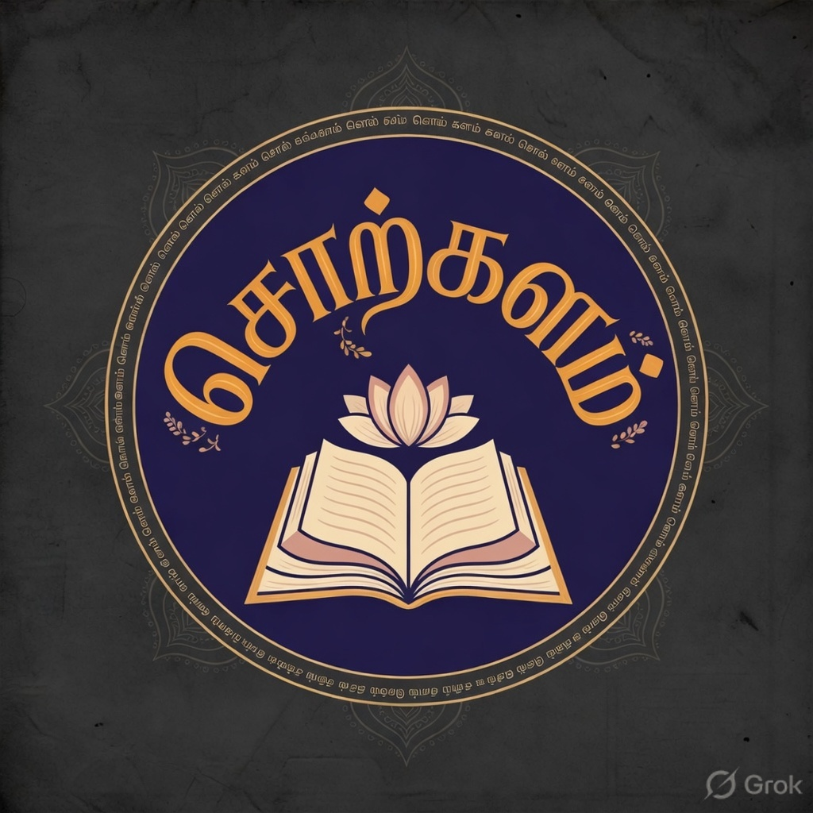
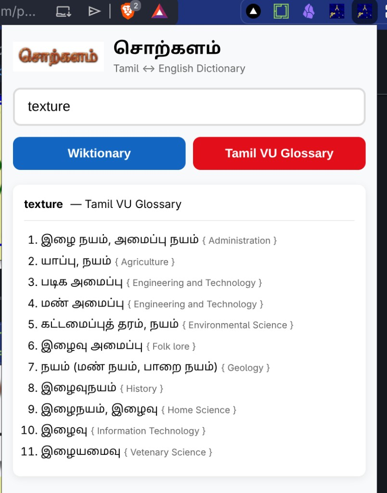
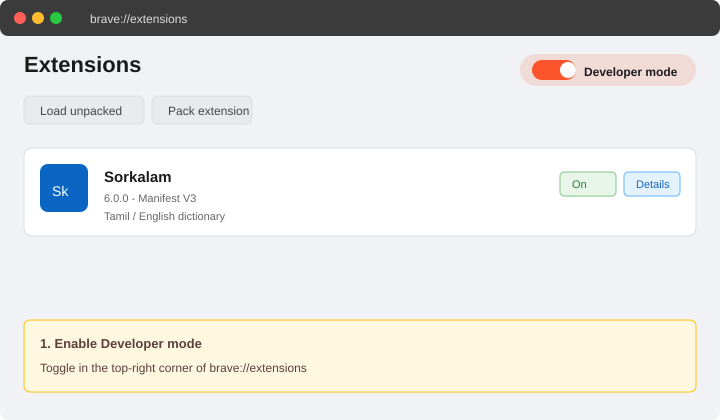

# Sorkalam (சொற்களம்)

**Tamil ↔ English lookup in your browser toolbar** — two glossaries for focused study, two research helpers when you want to go deeper.

  

## The Time Traveler's Story

> **2014 → 2026**  
> A time traveler from the future meets the original Sorkalam.

In **2014**, a developer created *Sorkalam* with a simple dream:  
**“Let Tamil learners tap any word and instantly understand it — without ever leaving the browser tab.”**

No new tabs. No distraction. Just pure, focused learning.

Ten years later, a time traveler arrived from **2026**. They opened the old code, smiled, and said:

> “The heart is still beating.  
> Only the clothes have changed.”

They adapted everything — Manifest V3, clean vanilla JavaScript, a clearer UI, faster performance — but kept the original promise intact:

- Instant glossary/thesaurus lookup  
- No context switching  
- Deep respect for the learner’s focus

Just like how **Grok** on X lets you tap **any post** and dive deeper without leaving your timeline, *Sorkalam* does the same for Tamil technical terms.

The time traveler left behind only one message before disappearing:

> “Some tools are not just software.  
> They are quiet bridges between generations of curious minds.”

---

### What Sorkalam offers

**Focus helpers (glossaries)** — results stay in the popup:

| | Source | Role |
|---|--------|------|
| **W** | [Wiktionary](https://www.wiktionary.org/) | Dictionary / thesaurus (Tamil ↔ English) |
| **TVU** | [Tamil Virtual University](https://www.tamilvu.org/) | Technical glossary (cached in the extension) |

**Research helpers** — open in a new tab:

| | Source | Role |
|---|--------|------|
| **G** | [Grok](https://grok.com/) | Take the conversation externally |
| **GP** | [Grokipedia](https://grokipedia.com/) | Broader, popular-articles lookup |

Type or highlight a word, then tap a chip — or press **Enter** for Wiktionary.

*Not on the Chrome Web Store yet — install from GitHub (below). Still on the old MV2 listing? See [TECH_DETAILS.md — MV2 / v5.5](TECH_DETAILS.md#still-using-the-manifest-v2-v55-build).*

---

## Quick start

| Step | Action |
|------|--------|
| 1 | Click the Sorkalam icon in the toolbar |
| 2 | Type Tamil or English; press **Enter** → Wiktionary |
| 3 | Or tap a provider chip (**W**, **TVU**, **G**, **GP** — see above) |
| 4 | **Pro tip:** select text on a page, then open the popup — it auto-fills and runs Wiktionary |

Click words inside Wiktionary results for a quick follow-up lookup.

  

---

## Download

You do not need Git. Download a zip, unzip it, then install in the browser (next section).

| What you want | Where to go | What to download |
|---------------|-------------|------------------|
| **Latest stable release** (recommended) | [github.com/p10ns11y/sorkalam-extension/releases](https://github.com/p10ns11y/sorkalam-extension/releases) | Open the newest release (e.g. **v6.1**) → under **Assets**, choose **Source code (zip)** |
| **A specific older version** | [github.com/p10ns11y/sorkalam-extension/tags](https://github.com/p10ns11y/sorkalam-extension/tags) | Click the tag you want (e.g. **v6**, **v5-legacy**) → **Download zip** |
| **Main branch (latest)** | [github.com/p10ns11y/sorkalam-extension](https://github.com/p10ns11y/sorkalam-extension) | Green **Code** button → **Download ZIP** |

After unzipping, open the folder named `sorkalam-extension-…` (or similar). Inside you should see `manifest.json` — that folder is what you load in the browser.

**Developers:** you can also `git clone https://github.com/p10ns11y/sorkalam-extension.git`.

---

## Install in Brave / Chrome (Developer Mode)

1. Unzip the download (or use your clone) so you have a folder containing **`manifest.json`** at its top level.
2. Open **`brave://extensions`** (or your browser’s extensions page — see table below).
3. Turn on **Developer mode** (top-right).

   

4. Click **Load unpacked** and select that folder (not a subfolder like `css/`).
5. Pin **Sorkalam** from the extensions menu (puzzle icon).
6. When you download a newer zip later, repeat from step 4 or click **Reload** on the extension card.

| Browser | Extensions URL |
|---------|------------------|
| Brave | `brave://extensions` |
| Chrome | `chrome://extensions` |
| Edge | `edge://extensions` |
| Chromium | `chrome://extensions` |

---

## Troubleshooting

| Issue | What to try |
|-------|-------------|
| **Load unpacked** greyed out | Enable **Developer mode** first |
| Extension fails to load | Select the folder that contains `manifest.json`; read the error on the card |
| Selected text not detected | Reload extension, refresh the page, select text **before** opening the popup |
| Lookup fails on some sites | `brave://`, Web Store, and some PDFs block scripts — try a normal web page |
| Changes not visible | **Reload** the extension after saving files, or load the new unzip folder again |
| Downloaded zip won’t load | Unzip first; pick the folder that contains `manifest.json`, not the outer Downloads wrapper |

Tamil VU cache and parsing: [TECH_DETAILS_V6.md — Tamil VU Glossary](TECH_DETAILS_V6.md#lookup-tamil-vu-glossary).

---

## For developers

| Document | Contents |
|----------|----------|
| **[TECH_DETAILS_V6.md](TECH_DETAILS_V6.md)** | MV3 architecture, provider chips, selection flow, Tamil VU cache diagram, file map |
| **[CHANGELOG.md](CHANGELOG.md)** | v6.0 release notes |
| **[TECH_DETAILS.md](TECH_DETAILS.md)** | Legacy MV2 / v5.x |
| **[`.cursor/skills/sorkalam/`](.cursor/skills/sorkalam/)** | Optional Cursor/agent snippets (message passing, service worker, content scripts) |

Chrome extension patterns: [GoogleChrome/modern-web-guidance](https://github.com/GoogleChrome/modern-web-guidance).

---

## License

GPL-2.0 — **பெரமு (Peramanathan Sathyamoorthy)**. Original concept (2014); adaptation (2026).

**வாழ்க தமிழ்! வாழ்க நற்றமிழர்!** 🇮🇳
