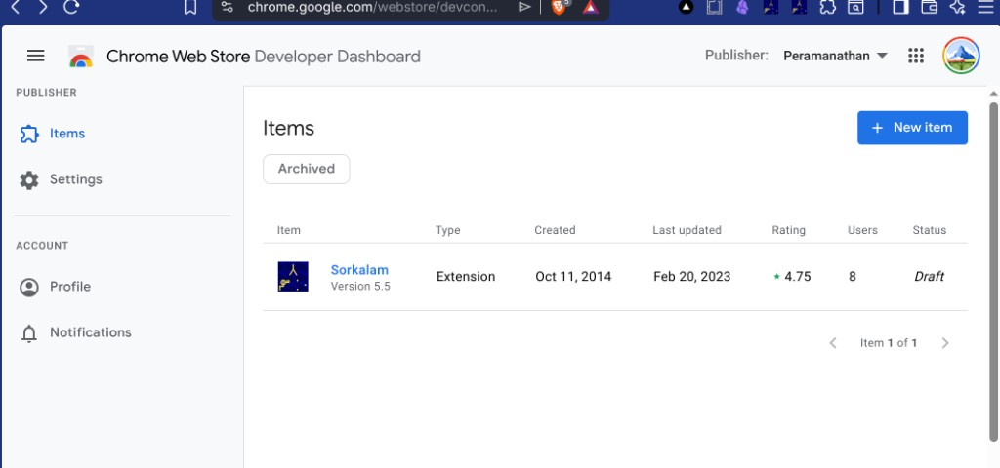

# Sorkalam (சொற்களம்) — Technical Details (Legacy v5.x)

> **This document describes the original extension (Manifest V2, jQuery, Glosbe + multi-source lookups).**  
> For the current **v6.0 Manifest V3** implementation, see **[TECH_DETAILS_V6.md](TECH_DETAILS_V6.md)**.  
> User-facing overview: **[README.md](README.md)**.

Sorkalam is a lightweight Chrome extension (originally Manifest V2) for quick Tamil ↔ English word/phrase lookups across multiple dictionary and glossary sources. It was designed for Tamil speakers, students, and technical translators.

## Core Architecture

- **Popup-driven**: All UI and logic lives in `popup.html` + `popup.js` (jQuery-based).
- **Language detection**: Heuristic in `filter()` using Unicode codepoint sums to distinguish Tamil vs English text.
- **Result handling**: Centralized `result(data)` function that dispatches based on global flags (`glosbe`, `wiki`, `tvu`, `google`).
- **Background + Content scripts** (`event.js`, `content.js`): Used only to capture currently selected text when the popup opens.

## Lookup Implementations

### 1. Glosbe (Default / Smart Lookup)
- **Trigger**: Enter key, auto on selection, or explicit Glosbe button.
- **API**: Glosbe public translate API via JSONP.
  - Endpoint: `https://glosbe.com/gapi/translate?from={from}&dest={dest}&format=json&phrase={word}&callback=result`
- **Language direction**: Auto-swapped based on detected language (`ta` ↔ `eng`).
- **Data processing** (`result()` when `glosbe === 1`):
  - Iterates `data.tuc[]` array.
  - Collects `phrase.text` and `meanings[].text` for both source and target languages.
  - Renders as `<ul>` lists.
- **Notes**: Most reliable free bilingual dictionary source at the time. Returns both direct translations and example meanings.

### 2. Wiktionary
- **Trigger**: Wiki button or clicking links inside previous Wiktionary results.
- **API**: MediaWiki `action=parse` (two parallel XHR calls).
  - Primary: `https://{des}.wiktionary.org/w/api.php?action=parse&prop=text|revid|displaytitle&format=json&page={word}`
  - Secondary: Same on the opposite language wiki (`{frm}.wiktionary.org`).
- **Processing** (`wikiRawParse()`):
  - Fetches raw HTML from both language editions.
  - Strips inline styles, widths, and rewrites external links to internal `#` anchors.
  - Extracts ordered (`<ol>`) and unordered (`<ul>`) lists.
  - Special handling: hides nested `ul` inside `ol` for cleaner Tamil results.
- **Hyperlink support**: Clicking any result link triggers another `wikiRawParse()` (recursive quick lookup).
- **Notes**: Good for etymology, usage notes, and technical terms. Works bidirectionally.

### 3. Tamil VU Glossary (tamilvu.org)
- **Trigger**: TVU button.
- **Method**: Direct scrape of the technical glossary search form.
  - Base URL: `http://www.tamilvu.org/slet/technical_glossary/tech_engser.jsp?...`
  - Dynamically appends `&key_sel=Tamil` or `&key_sel=English` depending on detected language.
- **Processing** (`tvuGlosSearch()` + `result()` when `tvu === 1`):
  - Parses the returned HTML table (`<tr>` elements).
  - Extracts term (column 3 or 4) + subject/category (column 2).
  - Renders as `<ol><li>term <i>{subject}</i></li>`.
- **Notes**: Focused on technical / academic terminology used by Tamil Virtual Academy. Best for domain-specific vocabulary (science, law, etc.).

### 4. Google
- **Current state**: Disabled / stub.
- **Original intent**: Google Translate API (no longer free).
- **Fallback behavior**: Constructs deep links to:
  - `https://www.google.com/search?q=...`
  - Google Translate search URLs (`translate+english+to+tamil+...`)
- **Notes**: Left in place for historical reasons and as a reminder of API economics.

## Language Detection (`filter()`)

```js
// Simplified logic
hashAdd = sum of charCodeAt(i) for each character
if (hashAdd is in Tamil Unicode range) → language = "tamil"
else if (hashAdd is in ASCII range)    → language = "english"
else                                   → language = "mixed"
```

- Strips special characters and normalizes whitespace.
- Sets global `frm`/`des` and `from`/`dest` variables used by all lookup functions.
- Controls visibility of pronunciation speaker icon (only for English).

## Data Flow Summary

1. User types or selects text → `filter()` detects language and cleans input.
2. Lookup function called (`glosbeLookup`, `wikiRawParse`, `tvuGlosSearch`, etc.).
3. Sets a global flag (`glosbe = 1`, `wiki = 1`, …) and `newURL`.
4. AJAX / XHR completes → `result(data)` is invoked.
5. `result()` checks flags, renders appropriate HTML into `#results` and `#newtab`.
6. Flags reset after rendering.

## Historical / Technical Notes

- Originally built with jQuery 1.10.2 and Manifest V2 patterns (`browser_action`, persistent background page).
- Heavy use of global variables for state (common in small legacy extensions).
- Content Security Policy was relaxed to allow calls to the four external dictionary domains.
- Pronunciation audio only implemented for English via Google’s static dictionary sound files.

This document serves as an archival reference for the lookup strategies and data parsing techniques used in the **legacy** extension.

---

## References

### Chrome Web Store (published, then archived)

**Sorkalam Version 5.5** was listed on the [Chrome Web Store](https://chrome.google.com/webstore) (created Oct 2014; last updated Feb 2023; from 50+ users to ~8 users; 4.75 rating). The developer-dashboard entry is now under **Archived** and remains in **Draft** status.

The store listing was not carried forward when work moved to **Manifest V3 (v6.0)** in this repository. Google requires MV3 for new extensions and updates; the MV2-based 5.5 package was archived rather than republished from the modernized tree. **v6.0** is intended for local/developer use until a new store submission is prepared.



### Still using the Manifest V2 (v5.5) build?

If you installed **Sorkalam** from the Web Store years ago, it may still appear in the browser even though the listing is archived. On `chrome://extensions` (Brave: `brave://extensions`), look for extension ID:

`jacclialpnbekableeihpjnojebafhho`

The listing was archived several years ago because upgrading and maintaining a **Manifest V3** release took longer than the maintenance window allowed. Keeping the old MV2 package on the store was not viable: Chrome now requires MV3 for new extensions and updates, and the move respects the stricter security model MV3 enforces.

**Options today:**

| Goal | What to do |
|------|------------|
| Keep an old Web Store install | No new installs from the store; your existing copy may keep working until the browser drops MV2 support. |
| Run legacy code yourself | Clone [p10ns11y/sorkalam-extension](https://github.com/p10ns11y/sorkalam-extension), check out **v5.5** at [https://github.com/p10ns11y/sorkalam-extension/tree/v5-legacy](https://github.com/p10ns11y/sorkalam-extension/tree/v5-legacy) (tag `v5-legacy`), then **Load unpacked** in Brave Developer Mode (same steps as [README.md](README.md#install-in-brave-developer-mode)). |
| Use the modern tree | Stay on this branch (`mv3v6` / v6.0) — see [TECH_DETAILS_V6.md](TECH_DETAILS_V6.md). |

The v5.5 source at [https://github.com/p10ns11y/sorkalam-extension/tree/v5-legacy](https://github.com/p10ns11y/sorkalam-extension/tree/v5-legacy) contains **no analytics or tracking code** added by the author. Any user counts or ratings shown in the Chrome Web Store developer dashboard come from **Google’s generic usage insights** for published extensions, not from custom telemetry in the extension.

---

## See also

| Document | Contents |
|----------|----------|
| [README.md](README.md) | Features, Brave install, usage |
| [TECH_DETAILS_V6.md](TECH_DETAILS_V6.md) | v6.0 MV3 architecture, Wiktionary + Tamil VU, selection capture |
| [CHANGELOG.md](CHANGELOG.md) | Version history |