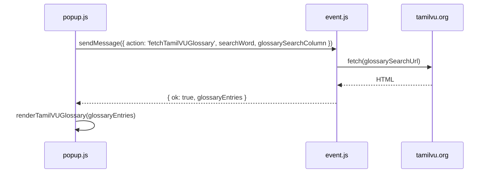

# Sorkalam (சொற்களம்) — Technical Details (v6.0)

> **This document describes the current Manifest V3 extension in this repository.**  
> For the original v5.x design (Glosbe, jQuery, MV2), see **[TECH_DETAILS.md](TECH_DETAILS.md)**.  
> User-facing overview: **[README.md](README.md)**.

Sorkalam v6.0 is a Chromium extension (Brave, Chrome, Edge) for Tamil ↔ English lookups via **Wiktionary** and the **Tamil Virtual University technical glossary**. It uses vanilla JavaScript, a service worker, and a content script—no jQuery in the active lookup path.

---

## Core Architecture

| Component | File | Role |
|-----------|------|------|
| Popup UI | `popup.html`, `popup.js`, `css/popup.css` | Input, buttons, fetch lookups, render results |
| Service worker | `event.js` | Relays selected text from the active tab to the popup |
| Content script | `content.js` | Tracks and returns page text selection (`<all_urls>`) |
| Manifest | `manifest.json` | MV3 permissions, content script registration, CSP |

**Data flow (typical session)**

1. User selects text on a page → `content.js` caches it via `selectionchange` / `mouseup` / `keyup`.
2. User opens the popup → `popup.js` sends `{ action: 'getSelectedWordFromPage' }` to `event.js`.
3. `event.js` messages the tab’s content script (`{ action: 'getSelectedWord' }`) or falls back to `chrome.scripting.executeScript`.
4. Popup fills `#word`, runs `detectLanguage()`, and calls `performLookup('wiki')` if text is non-empty.
5. User may switch source with **Wiktionary** or **Tamil VU Glossary** buttons, or press **Enter** (Wiktionary default).

---

## Manifest V3

- **Version**: `6.0.0`
- **Action**: `default_popup` → `popup.html`
- **Background**: `event.js` as non-persistent service worker
- **Content scripts**: `content.js` on `<all_urls>`, `document_idle`
- **Permissions**: `tabs`, `storage`, `scripting`, `activeTab`
- **Host permissions**: `*.wiktionary.org`, `https://www.tamilvu.org/*`
- **CSP** (extension pages): `script-src 'self'; object-src 'self';`

`jquery-1.10.2.js` remains in the repo from the legacy tree but is **not** loaded by `popup.html` in v6.0.

---

## Language Detection

Implemented in `popup.js` as `detectLanguage()` / `setLanguageDirection()` (replaces legacy `filter()` hash heuristic).

```js
// Count Tamil codepoints (U+0B80–U+0BFF) vs ASCII
if (tamilCount > asciiCount * 0.3) → 'tamil'  // fromLang=ta, toLang=en
else → 'english'                              // fromLang=en, toLang=ta
```

`toLang` selects the Wiktionary subdomain (`en.wiktionary.org` vs `ta.wiktionary.org`). Tamil VU uses `key_sel=Tamil` or `key_sel=English` based on `currentLanguage`.

---

## Lookup: Wiktionary

- **Trigger**: Enter, Wiktionary button, auto on popup open with selection, in-result `#` link clicks
- **API**: MediaWiki `action=parse` (single fetch per lookup)

```
https://{toLang}.wiktionary.org/w/api.php
  ?action=parse
  &prop=text|revid|displaytitle
  &format=json
  &page={word}
  &origin=*
```

- **Processing** (`lookupWiktionary` → `renderWiktionaryResults`):
  - Injects parsed HTML into `#results`
  - Shows `fromLang → toLang` badge
  - Wires `#` anchor clicks to re-run lookup with link text
- **Notes**: v6 does not dual-fetch both language wikis in one request (unlike legacy `wikiRawParse()`). Simpler, one edition per detected direction.

---

## Lookup: Tamil VU Glossary

- **Trigger**: Tamil VU Glossary button
- **URL**:

```
https://www.tamilvu.org/slet/technical_glossary/tech_engser.jsp
  ?selsub=All&schsel=full&editor={word}&key_sel={Tamil|English}
```

- **Availability**: The glossary endpoint is sometimes **temporarily down or very slow** (not an extension bug). When it recovers, the same URL works in Brave and in Sorkalam.
- **Fetch path**: Popup sends `{ action: 'fetchTamilVUGlossary', searchWord, glossarySearchColumn }`. The service worker fetches **HTTPS only**, then a **hidden-tab fallback** if needed. Returns `{ ok, glossaryEntries }` (parsed in the SW).



- **Processing** (`fetchTamilVUGlossary` in `event.js` parses HTML; popup `renderTamilVUGlossary` renders):
  - Regex table parse in the service worker (no `DOMParser` in MV3 service workers)
  - For each table row: detect Tamil in cells; prefer Tamil cell as **term**, column 2 as **subject**
  - Fallback to legacy column indices (3, 4, 2) when no Tamil script in row
  - Renders ordered list with `{ subject }` suffix
- **Errors**: Network or HTTP failures return `{ ok: false, error }`; the popup shows a message in `#status`.

---

## Selected Text Capture

### `content.js`

- Maintains `lastSelection` so highlight is not lost when focus moves to the popup
- Listens: `mouseup`, `keyup`, `selectionchange`
- Responds to `{ action: 'getSelectedWord' }` with `{ selectedWord: string }`

### `event.js`

- Handles `{ action: 'getSelectedWordFromPage' }` from the popup
- `chrome.tabs.sendMessage` → content script
- On failure: `chrome.scripting.executeScript` with `activeTab` (user invoked the extension)

### Restrictions

Selection and content scripts do not run on `brave://`, `chrome://`, extension store pages, or some PDF/embed contexts.

---

## Removed vs Legacy (v5.x)

| Feature | Legacy ([TECH_DETAILS.md](TECH_DETAILS.md)) | v6.0 (this doc) |
|---------|---------------------------------------------|-----------------|
| Glosbe | Default lookup | Removed |
| Google Translate stub | Present | Removed |
| jQuery | Required | Not used in popup |
| MV2 background page | `getBackgroundPage()` | Service worker + messages |
| Dual Wiktionary fetch | Both `frm` and `des` wikis | Single `toLang` wiki |
| Pronunciation audio | English speaker icon | Not implemented |

---

## File Map

```
popup.js       detectLanguage, lookupWiktionary, lookupTamilVU, performLookup, initializePopup
content.js     lastCapturedSelection cache, getSelectedWord message handler
event.js       getSelectedWordFromPage relay, Tamil VU glossary fetch
manifest.json  MV3 config
popup.html     UI shell (no jQuery script tag)
```

---

## Development references

v6.0 follows MV3 patterns documented in [`.cursor/skills/sorkalam/`](.cursor/skills/sorkalam/) (lean, repo-specific). Broader Chrome extension and web UI guidance: **[GoogleChrome/modern-web-guidance](https://github.com/GoogleChrome/modern-web-guidance/tree/main)** (referenced by link, not copied in full).

---

## See also

| Document | Contents |
|----------|----------|
| [README.md](README.md) | Features, Brave developer install, usage, references |
| [TECH_DETAILS.md](TECH_DETAILS.md) | Legacy v5.x; [Chrome Web Store archive note](TECH_DETAILS.md#references) (v5.5 published, archived for MV3) |
| [CHANGELOG.md](CHANGELOG.md) | Version history |
